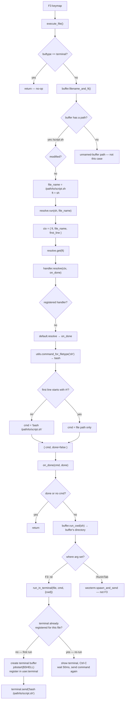

# run-buffer: F3 flow

What happens when you press **F3** on a buffer. This document starts with the simplest case: a saved shell script.

## Basic case

Assumptions:

- Named file on disk (e.g. `/path/to/script.sh`)
- `filetype` is `sh`
- Buffer is not modified
- No shebang on line 1
- First F3 press for this file (no existing run-terminal registered)

## Flowchart

## Step-by-step

1. **F3** calls `execute_file()` with no `where` argument → Neovim terminal split (not Wezterm tab).

2. **`buffer.filename_and_ft`** — file has a path and is not dirty → returns `/path/to/script.sh`, `sh`.

3. **`resolve.run`** — no `sh` handler in the registry → **`default.resolve`**:
   - `utils.command_for_filetype('sh')` → `bash`
   - no shebang → `bash /path/to/script.sh`

4. **`buffer.run_cwd`** — no custom `cwd` handler for `sh` → parent directory of the buffer file.

5. **`run_in_terminal`** (first run for this file):
   - creates a terminal buffer in a split
   - starts `$SHELL` with that `cwd`
   - sends `bash /path/to/script.sh`

## Re-run (F3 again on the same file)

Resolution is the same. `run_in_terminal` finds the existing terminal registered for that file path, shows it, sends `<C-c>`, waits 50ms, then sends the command again (and `cd` first if `cwd` changed).

## Related entry points

| Trigger | `where` | Destination |
| ------- | ------- | ------------- |
| `<F3>` | `nil` | `run_in_terminal` |
| `:RunInTerminal` | `'terminal'` | `run_in_terminal` |
| `:RunInTab` | `'tab'` | `wezterm.spawn_and_send` |

## Module map

| Step | Module |
| ---- | ------ |
| Keymap / orchestration | `init.lua` |
| Registry, default resolve, `run` | `resolve.lua` |
| Buffer path + save prompt | `buffer.lua` |
| Builtin handlers (except make) | `handlers/init.lua` |
| Makefile target picker | `handlers/make.lua` |
| Terminal split + per-file state | `user.terminal` |
